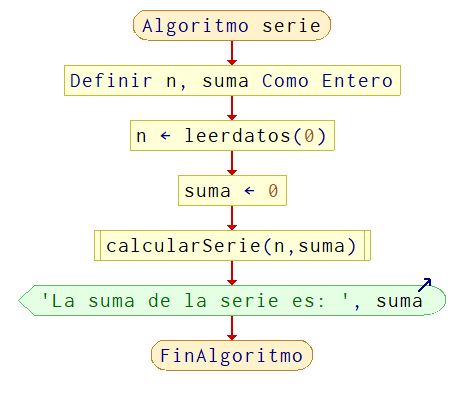
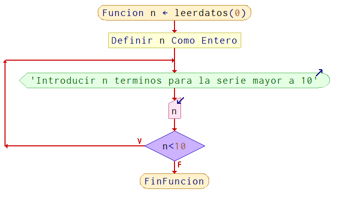
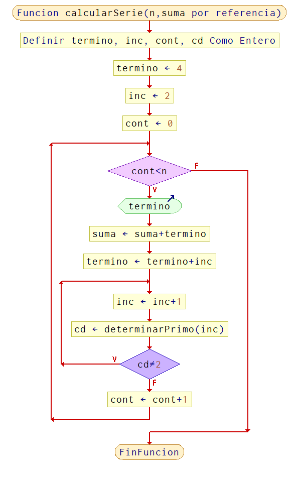
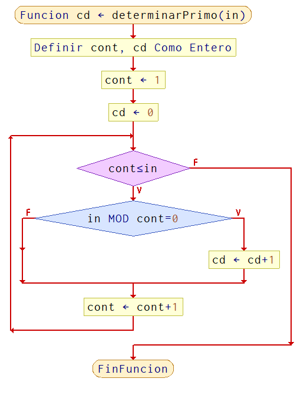

# 🧩 Ejercicio 03 — Serie de Números

> 📅 Clase 01 · 12 de Mayo de 2026 · _Con modularidad_

---

## 📝 Enunciado

Desarrollar un algoritmo **modular** que genere, muestre y sume la siguiente serie de números:

```
se = 4 + 6 + 9 + 14 + 21 + 32 + 45 + 62 + 81 + 104 + ...
```

Para **n términos mayor a 10**, aplicando **modularidad** mediante el uso de subprogramas (funciones/procedimientos).

---

## 🔍 Análisis del problema

> _Antes de escribir código, ¡hay que entender qué nos piden!_ 🕵️

### 📥 Datos de Entrada

Se ingresa `n`, cantidad de terminos de la serie. La funcion `leerdatos` valida que `n` sea mayor a 10 repitiendo la lectura hasta cumplir la condicion.


---

### 📤 Datos de Salida

Se muestra cada termino de la serie y al final se imprime la suma total: `La suma de la serie es: suma`.


---

### 🧠 Resolución

El programa principal lee `n`, inicializa `suma` en 0 y llama a `calcularSerie`.
En `calcularSerie` se comienza con `termino = 4` y `inc = 2`. En cada iteracion:
1. Se muestra el `termino` y se acumula en `suma`.
2. Se actualiza el `termino` sumando `inc`.
3. Se busca el siguiente incremento valido: se aumenta `inc` hasta que sea primo.
El control de primalidad se hace en `determinarPrimo`, contando divisores; si tiene 2 divisores es primo.
`suma` se pasa por referencia para que el resultado vuelva al programa principal.


---

### 🧩 Módulos identificados

> ✏️ _Definiendo las piezas del rompecabezas..._ 🔧 _(próximamente)_


---

## 📊 Diagrama de Flujo










---

## 💾 Pseudocódigo

Ver archivo 👉 [ejercicio3.psc](./ejercicio3.psc)

---

[⬅️ Volver a la clase](./README.md) &nbsp;|&nbsp; [🏠 Inicio](../index.html)