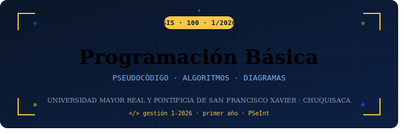

  

¡Bienvenido/a al repositorio oficial de la materia **Programación Básica (SIS100)**! 🎉  
Aquí encontrarás todos los ejercicios, diagramas de flujo y pseudocódigos desarrollados en clase, organizados por fecha para que puedas repasar cuando quieras.

---

## 👨‍🏫 Auxiliar

| | |
|---|---|
| **Nombre** | Marcela Miranda Veniz |
| **Correo** | mirandamarcela578@gmail.com |
| **Celular** | 67399831 |
| **Materia** | Programación Básica — SIS100 |
| **Gestión** | 1 - 2026 |

> 💬 Ante cualquier duda, no duden en escribirme por el grupo de whatsapp o imbox.

---

## 📋 ¿Cómo usar este repositorio?

1. 📁 Cada clase tiene su **propia carpeta** con la fecha correspondiente.
2. Dentro de cada carpeta encontrarás los **ejercicios del día**.
3. Cada ejercicio incluye:
   - 📝 **Enunciado** del problema
   - 📊 **Diagrama de flujo** (imagen)
   - 💾 **Pseudocódigo** en archivo `.psc` (PSeInt)
4. Al final de cada página hay un enlace para **volver al inicio** ⬆️

---

## 📅 Índice de Clases

| # | Fecha | Tema | Estado |
|---|-------|------|--------|
| 01 | [🗓️ 12 de Mayo](./Clase_1/README.md) | Introducción a la Modularidad · Conceptos Base | ✅ Disponible |
| 02 | [🗓️ 19 de Mayo](./Clase_2/README.md) | _Por definir_ | 🔒 Próximamente |
| 03 | [🗓️ 26 de Mayo](./Clase_3/README.md) | _Por definir_ | 🔒 Próximamente |
| 04 | [🗓️ 02 de Junio](./Clase_4/README.md) | _Por definir_ | 🔒 Próximamente |
| 05 | [🗓️ 09 de Junio](./Clase_5/README.md) | _Por definir_ | 🔒 Próximamente |
| 06 | [🗓️ 16 de Junio](./Clase_6/README.md) | _Por definir_ | 🔒 Próximamente |

---

## 🛠️ Herramientas que usamos

| Herramienta | Descripción | Descarga |
|-------------|-------------|---------|
|  | Entorno para pseudocódigo y diagramas de flujo | [psint.sourceforge.net](http://pseint.sourceforge.net/) |
|  | Repositorio del curso | Estás aquí 😄 |

---

## 📌 Notas importantes

- 📂 Las carpetas se irán habilitando **cada martes** después de la clase.
- 🖼️ Los diagramas de flujo son exportados directamente desde **PSeInt**.
- 📄 Los archivos `.psc` se abren con **PSeInt** instalado en tu computadora.

---

_Programación Básica SIS100 · Gestión 2025_  

